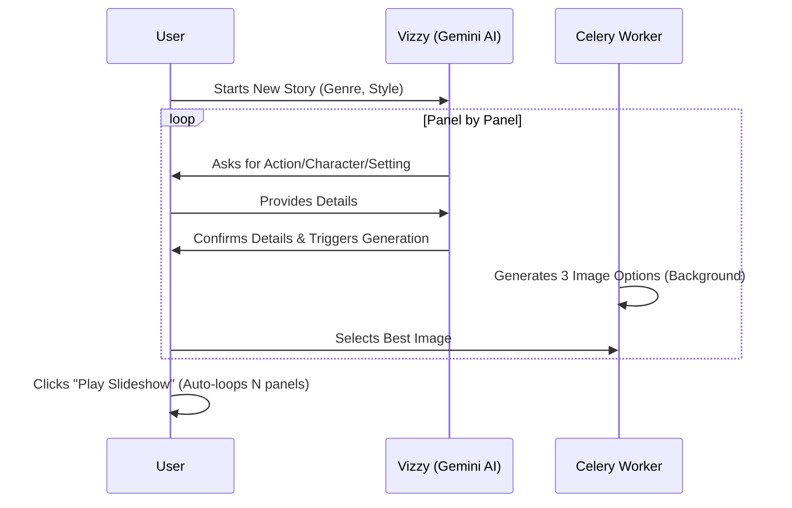
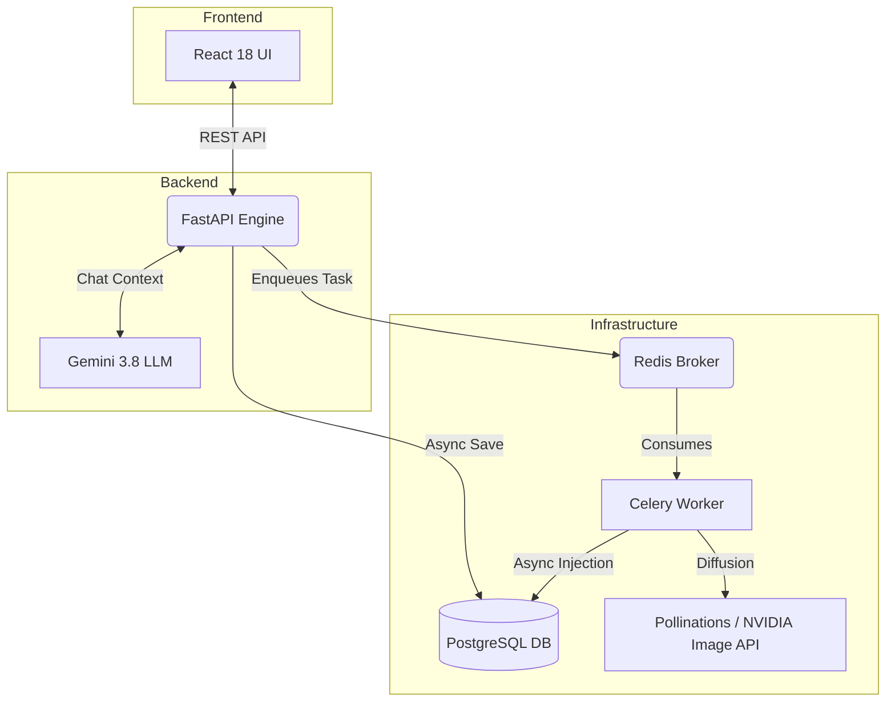
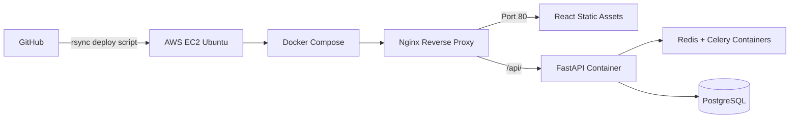

# VizzyStudio: AI-Directed Visual Storyboard Engine

VizzyStudio is a stateful web application that generates collaborative graphic novels and storyboards via an iterative AI chat interface.

---

## 🎯 Requirements & Fulfillment

| Requirement | Implementation Strategy | Technology |
| :--- | :--- | :--- |
| **Input** (Collaborative Chat) | Strict 4-step interview sequence guided by an AI Director. Context injected via DB memory. | `Gemini 3.8 Flash`, `React`, `Zustand` |
| **Flow** (Iterative Generation) | Async background rendering. AI hits external diffusion APIs without blocking the UI. | `FastAPI`, `Celery`, `Redis`, `Pollinations AI` |
| **Output** (Stitched Slideshow) | DB maps sequence order. CSS transitions animate the selected panels into an auto-loop. | `PostgreSQL`, `Tailwind CSS`, `HTML5` |

---

## 🔄 The Iterative User Journey

---

## 🏗️ Core System Architecture

---

## ☁️ Deployment Pipeline (AWS & Docker)

---

## 💾 Database Schema

| Table | Purpose | Key Columns |
| :--- | :--- | :--- |
| `stories` | Creative Bible (Global State) | `id`, `title`, `genre`, `visual_style` |
| `chat_messages` | AI Memory Context | `story_id`, `sender`, `content`, `quick_replies` |
| `panels` | Sequence & Camera Rules | `story_id`, `camera_angle`, `description` |
| `panel_options` | Media Assets (3 variants) | `panel_id`, `image_url`, `is_selected` |

---

## ⚡ Performance Optimizations

| Bottleneck | Diagnosis | Engineered Solution |
| :--- | :--- | :--- |
| **AI Context Hallucination** | Token bloat from sending entire chat history. | Strict **sliding-window memory** (last 10 messages). |
| **Worker DB Blocking** | Celery is synchronous, clashing with `asyncpg`. | Wrapped DB injection in an isolated **`asyncio.run()` loop** inside Celery. |
| **UI Scroll Lag** | Expensive CSS `backdrop-blur` repaints on scroll. | Stripped filters, injected **`transform-gpu`** & **`will-change-transform`**. Achieved 60fps. |

---

## 🚀 Testing & User Guide

*See **[GUIDE.md](./GUIDE.md)** for exact testing instructions, user flows, and shortcuts.*
