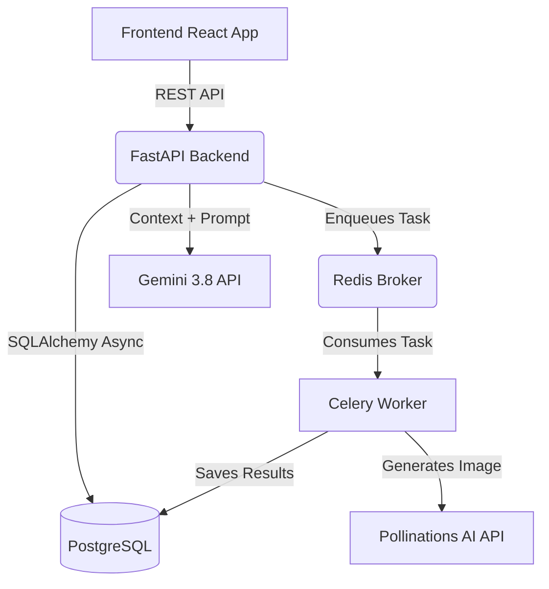

# VizzyStudio: AI-Powered Graphic Novel & Storyboard Creator

**VizzyStudio** is an interactive, stateful web application that allows users to iteratively design and generate comic book panels, visual books, or storyboards through a collaborative chat interface with an AI Creative Director. 

## 🚀 Tech Stack

### Frontend
- **Framework:** React 18 with TypeScript
- **Styling:** Tailwind CSS (Utility-first, responsive, and GPU-accelerated)
- **State Management:** Zustand (Lightweight global state for story and workflow progression)
- **Icons & Graphics:** Lucide React

### Backend
- **Framework:** FastAPI (Python) - High performance async API.
- **AI Integration:** Google Gemini (`gemini-3.8-flash`) for the conversational AI director.
- **Task Queue:** Celery with Redis as the message broker for async image generation.
- **Database:** PostgreSQL (Asyncpg) orchestrated via SQLAlchemy ORM.
- **External APIs:** Pollinations AI (Image Generation fallback to Unsplash/Picsum).

---

## 🏗️ System Architecture & Design

VizzyStudio relies on an event-driven, decoupled architecture where chat interactions are fast and synchronous, but heavy image generation tasks are offloaded to background workers.

### Key Workflows:
1. **Interactive Chat:** The frontend sends user prompts to the FastAPI backend. FastAPI retrieves the last 10 chat messages from Postgres to provide memory context, then queries the Gemini LLM. Gemini enforces a strict 4-step creative sequence before prompting generation.
2. **Background Image Generation:** When a panel generation is triggered, FastAPI delegates the prompt and style to Celery. Celery hits external AI generation models, creates 3 variations, and stores the resulting image metadata in Postgres asynchronously.
3. **Frontend Polling:** The React app polls the task status. Once the Celery worker reports success, the frontend fetches the options from Postgres.

---

## 💾 Database Schema

The database relies on three core models managed via SQLAlchemy. 

### 1. `stories`
Stores the high-level "Creative Bible" of the graphic novel.
- `id` (UUID, Primary Key)
- `title`, `genre`, `visual_style`, `synopsis` (Strings)
- `created_at`, `updated_at` (Timestamps)

### 2. `chat_messages`
Persists the chat history to give the AI memory context.
- `id` (UUID, Primary Key)
- `story_id` (UUID, Foreign Key)
- `sender` (Enum: `vizzy` or `user`)
- `content` (Text)
- `quick_replies` (JSONB)
- `created_at` (Timestamp)

### 3. `panels` & `panel_options`
Stores the individual scenes and the AI-generated variations.
- `id` (UUID, Primary Key)
- `story_id` (UUID, Foreign Key)
- `description`, `camera_angle` (Strings)
- `status` (Enum: generating, selected, etc.)
- **`panel_options` Table:** Linked to `panels`, stores `image_url`, `prompt`, `seed`, and boolean `is_selected`.

---

## 🔌 API Documentation

| Endpoint | Method | Description |
| :--- | :--- | :--- |
| `/api/v1/stories/` | `POST` | Creates a new Story/Creative Bible. |
| `/api/v1/chat/` | `POST` | Sends a user message, returns Vizzy's contextual AI response. |
| `/api/v1/chat/{story_id}` | `GET` | Retrieves the chronological chat history for a story. |
| `/api/v1/stories/{story_id}/panels/generate` | `POST` | Enqueues a Celery task to generate image options. Returns `task_id`. |
| `/api/v1/stories/task/{task_id}` | `GET` | Checks status of a Celery background task. |
| `/api/v1/stories/{story_id}/panels/{panel_id}/options` | `GET` | Retrieves generated image options from the database. |
| `/api/v1/stories/{story_id}/panels/{panel_id}/select/{option_id}` | `POST` | Approves a specific image option to be added to the final storyboard. |

---

## ⚡ Performance Optimizations

### Frontend Optimizations (Scroll Lag & Layout Thrashing)
- **Hardware Acceleration:** Injected `transform-gpu` and `will-change-transform` tags onto the panel cards and image containers. This forces the browser to offload hover animations to the GPU, preventing layout recalculation on the main thread.
- **Filter Stripping:** Removed expensive CSS `backdrop-blur` filters from large scrolling containers which were causing frame drops (scroll lag) when repainting moving pixels.

### Backend Optimizations (Async DB & Blocking Calls)
- **Async Celery Saves:** Originally, Celery's synchronous nature prevented it from easily saving the generated images back into the `asyncpg` Postgres database. This was engineered around by wrapping the DB injection in an isolated `asyncio.run()` loop within the Celery worker task.
- **LLM Context Throttling:** Rather than feeding the entire story history to Gemini on every request (which would hit token limits and slow down response times), the API strictly queries the database for the last `10` messages to provide just enough contextual awareness.

---

## 📜 Relevant Project Documents
- [STATUS.md](./STATUS.md) - Summary of blockers, challenges, and feature completion.
- [GUIDE.md](./GUIDE.md) - Step-by-step user guide and exact testing instructions.
