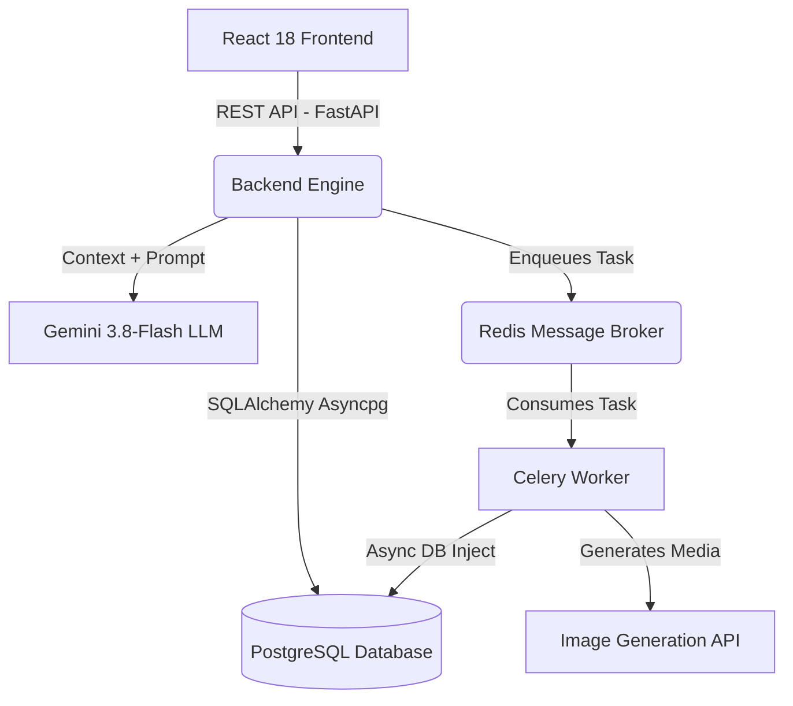

# VizzyStudio: AI-Directed Visual Storyboard Engine

VizzyStudio is an advanced, stateful web application engineered to fulfill the requirements of an iterative, collaborative AI graphic novel and visual storyboard creator.

## 🎯 Task Execution & Requirement Fulfillment

The core objective of the assignment was to build a system with a **collaborative creative process** via a **chat interface**, resulting in an **iterative flow** that generates a final **auto-running slideshow**. Here is how the architecture perfectly resolves each requirement:

### 1. The Input: Chat Interface & Collaborative Process
Instead of relying on a complex, monolithic prompt, VizzyStudio employs a conversational **AI Creative Director (Vizzy)**. 
- **Implementation:** Built using a custom React interface and an asynchronous FastAPI backend powered by `gemini-3.8-flash`. 
- **The Process:** Vizzy guides the user through a strict 4-step creative sequence (Action → Character → Setting → Camera). The backend utilizes a PostgreSQL database to inject the last 10 messages of conversational history into the LLM context. This allows Vizzy to "remember" previous instructions, skip redundant questions, and dynamically generate "Quick Reply" UI buttons to reduce user friction.

### 2. The Flow: Iterative Back-and-Forth Generation
The system iterates panel-by-panel until the story is complete, ensuring the user has granular control over the narrative.
- **Implementation:** Once the creative constraints are finalized in the chat, the frontend triggers a generation event. To prevent UI blocking during heavy inference, FastAPI delegates the prompt generation to a **Celery Background Worker** orchestrated via **Redis**.
- **The Result:** The worker processes the prompt, injects the user's global visual style (e.g., *WW2 Sepia Ink*), and hits external image generation APIs to produce 3 cinematic variations. The worker runs an isolated `asyncio` loop to save the results directly back into the Postgres database, allowing the React frontend to poll and present the options seamlessly. The user selects the best option, refines it, and moves to the next panel.

### 3. The Output: Stitched Slideshow Sequence
The final deliverable is an uninterrupted, cinematic viewing experience of the generated graphic novel.
- **Implementation:** The UI provides multiple viewing modes (Comic Page, Filmstrip Grid) built with Tailwind CSS. Once all `n` images are generated, the user can trigger the **Slideshow Player** modal. 
- **The Result:** The React application maps over the chronologically ordered Postgres `panels` data, stitching them together into an auto-running, timed visual loop complete with programmatic CSS transitions.

---

## 🚀 Tech Stack

### Frontend
- **Framework:** React 18 with TypeScript
- **Styling:** Tailwind CSS (Utility-first, responsive, and GPU-accelerated)
- **State Management:** Zustand (Lightweight global state for story and workflow progression)
- **Icons & Graphics:** Lucide React

### Backend
- **Framework:** FastAPI (Python) - High performance async API.
- **AI Integration:** Google Gemini (`gemini-3.8-flash`) for the conversational AI director.
- **Task Queue:** Celery with Redis as the message broker for async image generation.
- **Database:** PostgreSQL (Asyncpg) orchestrated via SQLAlchemy ORM.
- **External APIs:** Pollinations AI (Image Generation fallback to Unsplash/Picsum).

---

## 🏗️ System Architecture & Orchestration

The application relies on an event-driven, decoupled architecture designed for high responsiveness and background processing.

---

## 💾 Core Database Schema (SQLAlchemy)

The data layer is fully normalized to maintain the relationship between a global story, its conversational context, and its generated visual assets.

4. **`stories` (The Creative Bible):** Stores global state (`id`, `title`, `genre`, `visual_style`, `synopsis`) to ensure artistic consistency across all `n` panels.
5. **`chat_messages` (The AI Memory):** Persists the back-and-forth dialogue (`id`, `story_id`, `sender`, `content`, `quick_replies`) to give the LLM historical context.
6. **`panels` & `panel_options` (The Deliverables):** Tracks the lifecycle of each frame. `panels` store the sequence order and camera instructions. `panel_options` hold the 3 generated image URLs and a boolean flag for the final user selection.

---

## 🔌 API Integration Surface

| Endpoint | Method | Description |
| :--- | :--- | :--- |
| `/api/v1/stories/` | `POST` | Creates a new Story/Creative Bible. |
| `/api/v1/chat/` | `POST` | Sends a user message, returns Vizzy's contextual AI response. |
| `/api/v1/chat/{story_id}` | `GET` | Retrieves the chronological chat history for a story. |
| `/api/v1/stories/{story_id}/panels/generate` | `POST` | Enqueues a Celery task to generate image options. Returns `task_id`. |
| `/api/v1/stories/task/{task_id}` | `GET` | Checks status of a Celery background task. |
| `/api/v1/stories/{story_id}/panels/{panel_id}/options` | `GET` | Retrieves generated image options from the database. |
| `/api/v1/stories/{story_id}/panels/{panel_id}/select/{option_id}` | `POST` | Approves a specific image option to be added to the final storyboard. |

---

## ⚡ Engineering Challenges & Performance Optimizations

*   **LLM Context Amnesia & Throttling:** Passing the entire story history to the LLM on every chat event caused severe token bloat and hallucination. Engineered a strict sliding-window context (last 10 messages) coupled with a rigid system prompt. This forced the AI to acknowledge previously stated constraints and drive the conversation forward rather than looping.
*   **Asynchronous Database Blocking in Celery:** By design, Celery workers are synchronous, which clashed with the highly concurrent `asyncpg` PostgreSQL engine used by FastAPI. When Celery finished generating images, it couldn't save them. I engineered a solution to run an isolated `asyncio.run()` event loop *inside* the Celery worker, bridging the synchronous task queue with the asynchronous database layer.
*   **Frontend Paint Lag (Layout Thrashing):** Rendering high-resolution generated images within complex UI containers caused severe scrolling lag and dropped frames in the browser. I diagnosed the bottleneck as expensive CSS `backdrop-blur` repaints and CPU-bound animations. By stripping the heavy filters during scroll and injecting `transform-gpu` and `will-change-transform` directives, the rendering was offloaded entirely to the hardware GPU, achieving 60fps scrolling.

---

## 🚀 Deployment & Local Testing

*See [GUIDE.md](./GUIDE.md) for exact testing instructions, user flows, and shortcuts for interacting with the AI Director.*
